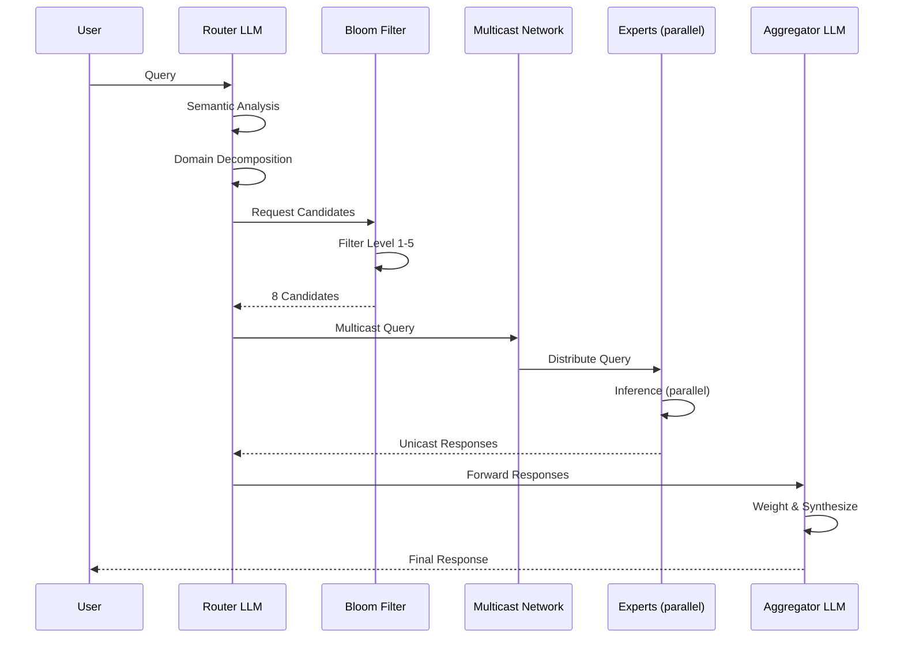

# NeuralMesh Workflow

**Version**: 0.1.0
**Status**: Draft
**Last Updated**: 30.09.2026

---

## 1. High-Level Workflow

```
┌─────────────────────────────────────────────────────────────────────┐
│                          USER SUBMITS QUERY                         │
│                                                                     │
│              "Analyze the physics of sound in this                  │
│               audio clip and its emotional impact."                 │
└────────────────────────────────┬────────────────────────────────────┘
                                 │
                                 ▼
┌─────────────────────────────────────────────────────────────────────┐
│                    LAYER 1: ROUTER LLM                              │
│                                                                     │
│  1. Semantic Analysis                                               │
│     → Tokenize query                                                │
│     → Embed query                                                   │
│     → Classify intent                                               │
│                                                                     │
│  2. Domain Decomposition                                            │
│     → Domains: [physics.acoustics,                                  │
│                 emotion.auditory,                                   │
│                 audio.analysis]                                     │
│                                                                     │
│  3. Prefix Selection                                                │
│     → 2001:db8:physics:acoustics::/64                               │
│     → 2001:db8:emotion:auditory::/64                                │
│     → 2001:db8:audio:analysis::/64                                  │
│                                                                     │
│  4. Cache Check                                                     │
│     → HIT?  → Return cached response                                │
│     → MISS? → Continue to Layer 2                                   │
└────────────────────────────────┬────────────────────────────────────┘
                                 │
                                 ▼
┌─────────────────────────────────────────────────────────────────────┐
│              LAYER 2: IPv6 BLOOM-FILTER ROUTING                     │
│                                                                     │
│  LEVEL 1: Area Prefixes        (10⁷ entries, 12.5 MB, 0.8% FP)      │
│  ┌───────────────────────────────────────────────────────────────┐  │
│  │  hash(2001:db8:physics::/48)  →  B₁[h₁(x)] = 1                │  │
│  │  hash(2001:db8:emotion::/48)  →  B₁[h₂(x)] = 1                │  │
│  │  hash(2001:db8:audio::/48)    →  B₁[h₃(x)] = 1                │  │
│  │  Result: 3 candidate areas                                    │  │
│  └───────────────────────────────────────────────────────────────┘  │
│                                 │                                   │
│                                 ▼                                   │
│  LEVEL 2: Domain Prefixes      (10⁷ entries, 12.5 MB, 0.8% FP)      │
│  ┌───────────────────────────────────────────────────────────────┐  │
│  │  expand(physics::/48)  →  {acoustics, optics, ...}            │  │
│  │  expand(emotion::/48)  →  {auditory, visual, ...}             │  │
│  │  expand(audio::/48)    →  {analysis, synthesis, ...}          │  │
│  │  Result: 3 candidate domains                                  │  │
│  └───────────────────────────────────────────────────────────────┘  │
│                                 │                                   │
│                                 ▼                                   │
│  LEVEL 3: Sub-Domain Prefixes  (10⁷ entries, 12.5 MB, 0.8% FP)      │
│  ┌───────────────────────────────────────────────────────────────┐  │
│  │  expand(acoustics::/64) → {ultrasound, infrasound, ...}       │  │
│  │  expand(auditory::/64)  → {pitch, rhythm, harmony, ...}       │  │
│  │  expand(analysis::/64)  → {spectral, temporal, ...}           │  │
│  │  Result: 3 candidate sub-domains                              │  │
│  └───────────────────────────────────────────────────────────────┘  │
│                                 │                                   │
│                                 ▼                                   │
│  LEVEL 4: Expert IDs           (10⁷ entries, 12.5 MB, 0.8% FP)      │
│  ┌───────────────────────────────────────────────────────────────┐  │
│  │  expand(ultrasound::/80) → {expert_001, expert_002, ...}      │  │
│  │  expand(pitch::/80)      → {expert_045, expert_046, ...}      │  │
│  │  expand(spectral::/80)   → {expert_089, expert_090, ...}      │  │
│  │  Result: 15 candidate experts                                 │  │
│  └───────────────────────────────────────────────────────────────┘  │
│                                 │                                   │
│                                 ▼                                   │
│  LEVEL 5: Metadata             (10⁷ entries, 12.5 MB, 0.8% FP)      │
│  ┌───────────────────────────────────────────────────────────────┐  │
│  │  Filter by: language, modality, latency, reputation           │  │
│  │  Result: 8 candidate experts                                  │  │
│  └───────────────────────────────────────────────────────────────┘  │
│                                                                     │
│  TOTAL LATENCY: ~500 ns                                             │
│  CUMULATIVE FP RATE: < 2%                                           │
└────────────────────────────────┬────────────────────────────────────┘
                                 │
                                 ▼
┌─────────────────────────────────────────────────────────────────────┐
│              LAYER 2.5: MULTICAST DISCOVERY                         │
│                                                                     │
│  Router sends multicast queries to relevant groups:                 │
│                                                                     │
│  ┌───────────────────────────────────────────────────────────────┐  │
│  │  Group 1: ff0e:2001:db8:physics:acoustics:ultrasound::1       │  │
│  │           Payload: {query, nonce, timestamp}                  │  │
│  │                                                               │  │
│  │  Group 2: ff0e:2001:db8:emotion:auditory:pitch::1             │  │
│  │           Payload: {query, nonce, timestamp}                  │  │
│  │                                                               │  │
│  │  Group 3: ff0e:2001:db8:audio:analysis:spectral::1            │  │
│  │           Payload: {query, nonce, timestamp}                  │  │
│  └───────────────────────────────────────────────────────────────┘  │
│                                                                     │
│  Only registered experts receive the query. No broadcast storm.     │
│  TOTAL LATENCY: 10–100 ms                                           │
└────────────────────────────────┬────────────────────────────────────┘
                                 │
                                 ▼
┌─────────────────────────────────────────────────────────────────────┐
│              LAYER 3: 2B EXPERTS (PARALLEL EXECUTION)               │
│                                                                     │
│  ┌──────────────┐  ┌──────────────┐  ┌──────────────┐               │
│  │ Expert 001   │  │ Expert 045   │  │ Expert 089   │               │
│  │ (Ultrasound) │  │ (Pitch)      │  │ (Spectral)   │               │
│  │              │  │              │  │              │               │
│  │ ┌──────────┐ │  │ ┌──────────┐ │  │ ┌──────────┐ │               │
│  │ │ 2B LLM   │ │  │ │ 2B LLM   │ │  │ │ 2B LLM   │ │               │
│  │ │ INT4     │ │  │ │ INT4     │ │  │ │ INT4     │ │               │
│  │ │ 1 GB     │ │  │ │ 1 GB     │ │  │ │ 1 GB     │ │               │
│  │ └──────────┘ │  │ └──────────┘ │  │ └──────────┘ │               │
│  │              │  │              │  │              │               │
│  │ 100–1000 ms  │  │ 100–1000 ms  │  │ 100–1000 ms  │               │
│  └──────┬───────┘  └──────┬───────┘  └──────┬───────┘               │
│         │                 │                 │                       │
│  ┌──────┴───────┐  ┌──────┴───────┐  ┌──────┴───────┐               │
│  │ Expert 002   │  │ Expert 046   │  │ Expert 090   │               │
│  │ (Infrasound) │  │ (Rhythm)     │  │ (Temporal)   │               │
│  │              │  │              │  │              │               │
│  │ 100–1000 ms  │  │ 100–1000 ms  │  │ 100–1000 ms  │               │
│  └──────┬───────┘  └──────┬───────┘  └──────┬───────┘               │
│         │                 │                 │                       │
│         └─────────────────┼─────────────────┘                       │
│                           │                                         │
│  All experts execute in PARALLEL.                                   │
│  TOTAL LATENCY: max(individual latencies) ≈ 100–1000 ms             │
└────────────────────────────────┬────────────────────────────────────┘
                                 │
                                 ▼
┌─────────────────────────────────────────────────────────────────────┐
│              LAYER 3.5: RESPONSE COLLECTION                         │
│                                                                     │
│  Experts respond via UNICAST:                                       │
│                                                                     │
│  ┌───────────────────────────────────────────────────────────────┐  │
│  │  Expert 001 → Router:                                          │  │
│  │    {response: "Ultrasound frequencies above 20kHz create...",  │  │
│  │     confidence: 0.94,                                          │  │
│  │     signature: <signature>,                                    │  │
│  │     nonce: <nonce>}                                            │  │
│  │                                                                │  │
│  │  Expert 045 → Router:                                          │  │
│  │    {response: "Pitch affects emotional perception through...", │  │
│  │     confidence: 0.89,                                          │  │
│  │     signature: <signature>,                                    │  │
│  │     nonce: <nonce>}                                            │  │
│  │                                                                │  │
│  │  Expert 089 → Router:                                          │  │
│  │    {response: "Spectral analysis shows...",                    │  │
│  │     confidence: 0.91,                                          │  │
│  │     signature: <signature>,                                    │  │
│  │     nonce: <nonce>}                                            │  │
│  │                                                                │  │
│  │  ... (5 more responses)                                        │  │
│  └───────────────────────────────────────────────────────────────┘  │
│                                                                     │
│  Router verifies signatures and nonces.                             │
│  TOTAL LATENCY: ~10 ms                                              │
└────────────────────────────────┬────────────────────────────────────┘
                                 │
                                 ▼
┌─────────────────────────────────────────────────────────────────────┐
│              LAYER 4: AGGREGATOR LLM                                │
│                                                                     │
│  1. Collect Responses                                               │
│     → 8 expert responses received                                   │
│                                                                     │
│  2. Weight by Confidence & Reputation                               │
│     → Expert 001: 0.94 × 0.92 reputation = 0.865                    │
│     → Expert 045: 0.89 × 0.88 reputation = 0.783                    │
│     → Expert 089: 0.91 × 0.95 reputation = 0.865                    │
│     → ...                                                           │
│                                                                     │
│  3. Synthesize Coherent Answer                                      │
│     → Combine physics + emotion + audio insights                    │
│     → Resolve contradictions                                        │
│     → Generate natural language response                            │
│                                                                     │
│  4. Cache Result                                                    │
│     → Semantic cache: store embedding → response                    │
│     → Exact cache: store hash(query) → response                     │
│                                                                     │
│  5. Return to User                                                  │
│     → Final response                                                │
│     → Citations (which experts contributed)                         │
│     → Confidence score                                              │
│                                                                     │
│  TOTAL LATENCY: 200–1000 ms                                         │
└────────────────────────────────┬────────────────────────────────────┘
                                 │
                                 ▼
┌─────────────────────────────────────────────────────────────────────┐
│                          USER RECEIVES ANSWER                       │
│                                                                     │
│  "The audio clip contains ultrasound frequencies above 20kHz        │
│   that create a subtle sense of unease, while the pitch             │
│   modulation in the 200–400 Hz range evokes nostalgia.              │
│   Spectral analysis reveals a harmonic structure that..."           │
│                                                                     │
│  Confidence: 0.91                                                   │
│  Experts consulted: 8                                               │
│  Total latency: 812 ms                                              │
└─────────────────────────────────────────────────────────────────────┘
```

---

## 2. Detailed Message Flow

```
┌──────────┐     ┌──────────┐     ┌──────────┐     ┌──────────┐
│   User   │     │  Router  │     │  Bloom   │     │ Experts  │
│          │     │   LLM    │     │  Filter  │     │          │
└────┬─────┘     └────┬─────┘     └────┬─────┘     └────┬─────┘
     │                │                │                │
     │  Query         │                │                │
     │───────────────>│                │                │
     │                │                │                │
     │                │  Semantic      │                │
     │                │  Analysis      │                │
     │                │────┐           │                │
     │                │    │           │                │
     │                │<───┘           │                │
     │                │                │                │
     │                │  Prefixes      │                │
     │                │───────────────>│                │
     │                │                │                │
     │                │                │  Filter        │
     │                │                │  Candidates    │
     │                │                │────┐           │
     │                │                │    │           │
     │                │                │<───┘           │
     │                │                │                │
     │                │  Candidates    │                │
     │                │<───────────────│                │
     │                │                │                │
     │                │  Multicast Query                │
     │                │────────────────────────────────>│
     │                │                │                │
     │                │                │  Inference     │
     │                │                │  (parallel)    │
     │                │                │                │────┐
     │                │                │                │    │
     │                │                │                │<───┘
     │                │                │                │
     │                │  Unicast Responses              │
     │                │<────────────────────────────────│
     │                │                │                │
     │                │  Aggregate     │                │
     │                │────┐           │                │
     │                │    │           │                │
     │                │<───┘           │                │
     │                │                │                │
     │  Response      │                │                │
     │<───────────────│                │                │
     │                │                │                │
```

---

## 3. Expert Lifecycle

```
┌─────────────────────────────────────────────────────────────────────┐
│                      EXPERT LIFECYCLE                               │
└─────────────────────────────────────────────────────────────────────┘

   ┌──────────────┐
   │ 1. TRAINING  │
   │              │
   │ - Fine-tune  │
   │   2B model   │
   │ - Distill    │
   │   from 70B   │
   │ - Validate   │
   └──────┬───────┘
          │
          ▼
   ┌──────────────┐
   │ 2. PACKAGING │
   │              │
   │ - Quantize   │
   │   (INT4)     │
   │ - Build      │
   │   Docker     │
   │ - Sign image │
   └──────┬───────┘
          │
          ▼
   ┌──────────────┐
   │ 3. REGISTER  │
   │              │
   │ - Generate   │
   │   keypair    │
   │ - Compute    │
   │   expert ID  │
   │ - Register   │
   │   in registry│
   └──────┬───────┘
          │
          ▼
   ┌──────────────┐
   │ 4. ANNOUNCE  │
   │              │
   │ - Join       │
   │   multicast  │
   │   group      │
   │ - Add to     │
   │   Bloom      │
   │   filter     │
   └──────┬───────┘
          │
          ▼
   ┌──────────────┐
   │ 5. SERVE     │
   │              │
   │ - Receive    │
   │   queries    │
   │ - Run        │
   │   inference  │
   │ - Send       │
   │   response   │
   └──────┬───────┘
          │
          ▼
   ┌──────────────┐
   │ 6. EARN      │
   │              │
   │ - Receive    │
   │   micropay   │
   │ - Build      │
   │   reputation │
   └──────┬───────┘
          │
          ▼
   ┌──────────────┐
   │ 7. EVOLVE    │
   │              │
   │ - Collect    │
   │   feedback   │
   │ - Retrain    │
   │ - Redeploy   │
   └──────┬───────┘
          │
          └──────────> (back to step 1)
```

---

## 4. Routing Decision Tree

```
                          ┌──────────────┐
                          │  Query       │
                          └──────┬───────┘
                                 │
                                 ▼
                    ┌────────────────────────┐
                    │  Cache HIT?            │
                    └────────┬───────────────┘
                             │
                 ┌───────────┴───────────┐
                 │ YES                   │ NO
                 ▼                       ▼
          ┌──────────────┐    ┌──────────────────────┐
          │ Return       │    │ Semantic Analysis    │
          │ Cached       │    │ (Router LLM)         │
          │ Response     │    └──────────┬───────────┘
          └──────────────┘               │
                                         ▼
                              ┌──────────────────────┐
                              │ Domain Decomposition │
                              └──────────┬───────────┘
                                         │
                                         ▼
                              ┌──────────────────────┐
                              │ Bloom-Filter Routing │
                              │ (5 levels)           │
                              └──────────┬───────────┘
                                         │
                                         ▼
                              ┌──────────────────────┐
                              │ Candidates < 20?     │
                              └──────────┬───────────┘
                                         │
                             ┌───────────┴───────────┐
                             │ YES                   │ NO
                             ▼                       ▼
                    ┌──────────────┐    ┌──────────────────────┐
                    │ Multicast    │    │ Expand Bloom Filter  │
                    │ Query        │    │ (more levels)        │
                    └──────┬───────┘    └──────────┬───────────┘
                           │                       │
                           │                       └──────> (back)
                           ▼
                    ┌──────────────┐
                    │ Experts      │
                    │ Execute      │
                    │ (parallel)   │
                    └──────┬───────┘
                           │
                           ▼
                    ┌──────────────┐
                    │ Collect      │
                    │ Responses    │
                    └──────┬───────┘
                           │
                           ▼
                    ┌──────────────┐
                    │ Consensus?   │
                    │ (>50% agree) │
                    └──────┬───────┘
                           │
               ┌───────────┴───────────┐
               │ YES                   │ NO
               ▼                       ▼
        ┌──────────────┐    ┌──────────────────────┐
        │ Aggregate    │    │ Query Additional     │
        │ & Return     │    │ Experts / Escalate   │
        └──────────────┘    └──────────┬───────────┘
                                       │
                                       └──────> (back)
```

---

## 5. Failure Handling

```
┌─────────────────────────────────────────────────────────────────────┐
│                      FAILURE MODES & RECOVERY                       │
└─────────────────────────────────────────────────────────────────────┘

  ┌─────────────────────┐
  │ Expert Unavailable  │
  │ (timeout, crash)    │
  └──────────┬──────────┘
             │
             ▼
  ┌─────────────────────┐
  │ 1. Timeout (500ms)  │
  │ 2. Retry (1x)       │
  │ 3. Fallback to peer │
  │ 4. Log failure      │
  └─────────────────────┘

  ┌─────────────────────┐
  │ Router LLM Down     │
  └──────────┬──────────┘
             │
             ▼
  ┌─────────────────────┐
  │ 1. Anycast failover │
  │ 2. Route to replica │
  │ 3. Log incident     │
  └─────────────────────┘

  ┌─────────────────────┐
  │ Network Partition   │
  └──────────┬──────────┘
             │
             ▼
  ┌─────────────────────┐
  │ 1. Local routing    │
  │ 2. Queue queries    │
  │ 3. Sync on reconnect│
  └─────────────────────┘

  ┌─────────────────────┐
  │ Malicious Expert    │
  └──────────┬──────────┘
             │
             ▼
  ┌─────────────────────┐
  │ 1. Signature check  │
  │ 2. Reputation drop  │
  │ 3. Blacklist        │
  │ 4. Re-query others  │
  └─────────────────────┘

  ┌─────────────────────┐
  │ Sybil Attack        │
  └──────────┬──────────┘
             │
             ▼
  ┌─────────────────────┐
  │ 1. PoS verification │
  │ 2. Reputation check │
  │ 3. Rate limiting    │
  │ 4. Network analysis │
  └─────────────────────┘
```

---

## 6. Data Flow Summary

```
┌─────────────────────────────────────────────────────────────────────┐
│                      LATENCY BREAKDOWN                              │
├─────────────────────────────────────────────────────────────────────┤
│                                                                     │
│  Component                  │  Latency        │  % of Total         │
│  ───────────────────────────┼─────────────────┼─────────────────    │
│  Router LLM                 │  100–500 ms     │  ~25%               │
│  Bloom Filter (5 levels)    │  ~500 ns        │  <0.01%             │
│  Multicast Roundtrip        │  10–100 ms      │  ~5%                │
│  Expert Inference (max)     │  100–1000 ms    │  ~50%               │
│  Response Collection        │  ~10 ms         │  ~1%                │
│  Aggregator LLM             │  200–1000 ms    │  ~20%               │
│  ───────────────────────────┼─────────────────┼─────────────────    │
│  TOTAL                      │  500–2500 ms    │  100%               │
│                                                                     │
└─────────────────────────────────────────────────────────────────────┘
```

---

## 7. Sequence Diagram (Mermaid)



---

## 8. Network Topology

```
                         ┌─────────────────┐
                         │   Router LLM    │
                         │  (centralized)  │
                         └────────┬────────┘
                                  │
              ┌───────────────────┼───────────────────┐
              │                   │                   │
              ▼                   ▼                   ▼
     ┌─────────────────┐ ┌─────────────────┐ ┌─────────────────┐
     │   Area 1        │ │   Area 2        │ │   Area 3        │
     │   (Physics)     │ │   (Emotion)     │ │   (Audio)       │
     │                 │ │                 │ │                 │
     │  ┌───────────┐  │ │  ┌───────────┐  │ │  ┌───────────┐  │
     │  │ Expert    │  │ │  │ Expert    │  │ │  │ Expert    │  │
     │  │ Expert    │  │ │  │ Expert    │  │ │  │ Expert    │  │
     │  │ Expert    │  │ │  │ Expert    │  │ │  │ Expert    │  │
     │  │   ...     │  │ │  │   ...     │  │ │  │   ...     │  │
     │  └───────────┘  │ │  └───────────┘  │ │  └───────────┘  │
     │                 │ │                 │ │                 │
     │  Multicast:     │ │  Multicast:     │ │  Multicast:     │
     │  ff0e:physics::1│ │  ff0e:emotion::1│ │  ff0e:audio::1  │
     └─────────────────┘ └─────────────────┘ └─────────────────┘
              │                   │                   │
              └───────────────────┼───────────────────┘
                                  │
                                  ▼
                         ┌─────────────────┐
                         │ Aggregator LLM  │
                         │  (centralized)  │
                         └────────┬────────┘
                                  │
                                  ▼
                         ┌─────────────────┐
                         │      User       │
                         └─────────────────┘
```

---

## 9. Legend

```
┌─────────┐
│  Box    │  = Component / Process
└─────────┘

   ────>    = Data Flow / Message
   ────│    = Alternative Path
   ────┴    = Branch / Decision

  [x]       = Completed Step
  [ ]       = Pending Step
  ⏳        = In Progress
  ✅        = Done
```

---

## References

See `README.md` for the full reference list.
